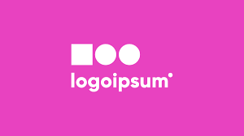

<div id="top"></div>


[![Contributors][contributors-shield]][contributors-url]
[![LinkedIn][linkedin-shield]][linktree-url]


<!-- PROJECT LOGO -->
<br />
<div align="center">
  <a href="https://github.com/dcdemps/468project">
    
  </a>

  <h3 align="center">Banking Application</h3>

  <p align="center">
    A simple banking application made as CSC-468 project
    <br />
  </p>
</div>


<!-- TABLE OF CONTENTS -->
<div>
	<summary>Table of Contents</summary>
		<ol>
			<li>
			<a href="#about-the-project">About The Project</a>
			<ul>
				<li><a href="#built-with">Built With</a></li>
			</ul>
			</li>
			<li>
			<a href="#getting-started">Getting Started</a>
			<ul>
				<li><a href="#prerequisites">Prerequisites</a></li>
				<li><a href="#installation">Installation</a></li>
			</ul>
			</li>
			<li><a href="#roadmap">Roadmap</a></li>
			<li><a href="#contact">Contact</a></li>
			<li><a href="#acknowledgments">Acknowledgments</a></li>
		</ol>
<div/>


<!-- ABOUT THE PROJECT -->
## About The Project


[![Account Page Screen Shot][product-screenshot]](https://example.com)

There are many great README templates available on GitHub; however, I didn't find one that really suited my needs so I created this enhanced one. I want to create a README template so amazing that it'll be the last one you ever need -- I think this is it.

Here's why:
* Your time should be focused on creating something amazing. A project that solves a problem and helps others
* You shouldn't be doing the same tasks over and over like creating a README from scratch
* You should implement DRY principles to the rest of your life :smile:

Of course, no one template will serve all projects since your needs may be different. So I'll be adding more in the near future. You may also suggest changes by forking this repo and creating a pull request or opening an issue. Thanks to all the people have contributed to expanding this template!

Use the `BLANK_README.md` to get started.

<p align="right">(<a href="#top">back to top</a>)</p>


### Built With

* [Docker](https://www.docker.com/)
* [React.js](https://reactjs.org/)
* [Express.js](https://expressjs.com/)
* [MySQL](https://www.mysql.com/)

<p align="right">(<a href="#top">back to top</a>)</p>


<!-- GETTING STARTED -->
## Getting Started

To get a local copy of the project up and running follow these steps.

### Prerequisites

* [Docker Desktop](https://www.docker.com/products/docker-desktop)

### Installation

1. Clone the repo
   ```sh
   git clone https://github.com/dcdemps/468project.git
   ```
2. Run the docker command
   ```sh
   docker-compose up --detach
   ```

<p align="right">(<a href="#top">back to top</a>)</p>


<!-- ROADMAP -->
## Roadmap

- [x] Add Web UI
- [x] Add MySQL Database
- [x] Add Express.js API
	- [] Add API calls for all of the react components
- [] Add user authentication
- [] Add Program that adds money to savings accounts
- [] 


<p align="right">(<a href="#top">back to top</a>)</p>


<!-- CONTACT -->
## Contact

Your Name - [@your_twitter](https://twitter.com/your_username) - email@example.com

Project Link: [https://github.com/dcdemps/468project](https://github.com/dcdemps/468project)

<p align="right">(<a href="#top">back to top</a>)</p>


<!-- ACKNOWLEDGMENTS -->
## Acknowledgments

* [README Template](https://github.com/othneildrew/Best-README-Template)
* [React Router](https://v5.reactrouter.com/)
* [MySQL2](https://www.npmjs.com/package/mysql2)
* [Nodemon](https://www.npmjs.com/package/nodemon)
* [User Authentication](https://www.digitalocean.com/community/tutorials/how-to-add-login-authentication-to-react-applications)

<p align="right">(<a href="#top">back to top</a>)</p>


<!-- MARKDOWN LINKS & IMAGES -->
<!-- https://www.markdownguide.org/basic-syntax/#reference-style-links -->
[contributors-shield]: https://img.shields.io/github/contributors/dcdemps/468project?style=for-the-badge
[contributors-url]: https://github.com/dcdemps/468project/graphs/contributors
[linkedin-shield]: https://img.shields.io/badge/-LinkedIn-black.svg?style=for-the-badge&logo=linkedin&colorB=555
[linktree-url]: https://linktr.ee/roaming432
[product-screenshot]: images/screenshot.png